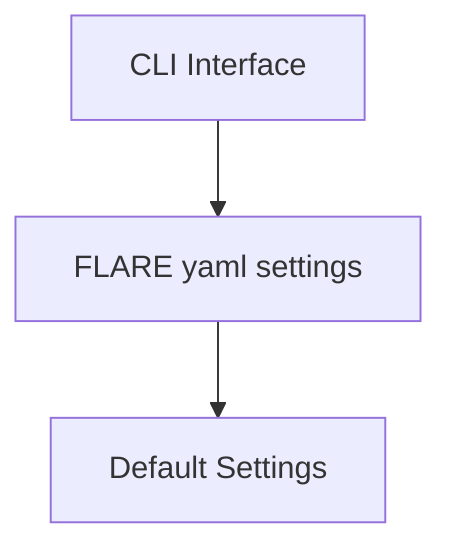

The FLARE Commandline Interface (CLI) is the entry point for all things FLARE. Here we will discuss the various tools within that a user can utilize for their workflow requirements. 

## FLARE Run 
``` bash
$ flare run -- help
< INSERT THE OUTPUT>
mcproduction, analysis
```
The `run` method is the entry point in which a user can run their workflow. Currently, there are 2 workflows implement into FLARE, the `mcproduction` and `analysis`. Irespective on which one you choose, they have a set of common arguments.

```bash
options:
  -h, --help            show this help message and exit
  --name NAME           Name of the study
  --version VERSION     Version of the study
  --description DESCRIPTION
                        Description of the study
  --study-dir STUDY_DIR
                        Study directory path where the files for production are located
  --output-dir OUTPUT_DIR
                        The location where the output file will be produced, by default will be the current working directory
  --config-yaml CONFIG_YAML
                        Path to a YAML config file
```

### --name and --version
Important to note is the `--name` and `--version` options will affect the output directory structure. For example if the following command is ran:

```bash
flare run analysis --name docs --version 1.0
```
The output data directory that FLARE creates will have the following structure

```
data/docs/1.0/...
```

This design means if a workflow needs to be reran with slight changes one can just change the name OR version number depending on what suits the users needs.  


### --description
The ` --description` option allows the user to provide a description of their workflow, what it is achieving or what assumptions one should know if they are to revisit this workflow in the future. The text provided is bundled into a `README.md` file located inside the output directory structure, eg:

```bash
ls data/docs/1.0/README.md
```

### --study-dir
It is common practice to store your workflow input files in your current working directory. However, this option allows a user to tell FLARE if a different directory contains the input files for the workflow. 

```bash
flare run mcproduction --study-dir ../different_input_files
```

### --output-dir
By default all the output directory structure of FLARE is created in the current working directory. If a user wishes to have the output directory structure located elsewhere, they can provide a path via the `--output-dir` option.

```bash
flare run analysis --output-dir ../../central_FLARE_outputs
```

### FLARE run analysis: --mcprod
The `flare run analysis` command has one addtional argument, namely `--mcprod `. This 

## Workflow Settings with `flare.yaml`
The `flare.yaml` is the configuration file located in your current working directory. This is where FLARE will look for additinal configuration settings required for the workflow. 

It is also the located in which a user can interact with the [b2luigi](https://b2luigi.belle2.org/) backend settings manager. 

### Customizable FLARE Settings
This yaml file allows a user to set the `--name`, `--version` and `--description` from the CLI tool. This can simplify the running of a workflow by having these settings defined in this central yaml file rather than adding it to the CLI command each time a workflow is ran. 

```YAML
# flare.yaml
name: docs
version: 1.0
description: This workflow is defined in the documentation
```

As mentioned a user can set any [b2luigi](https://b2luigi.belle2.org/) settings here in the `flare.yaml`. Importantly, this is where a user can set the `batch_system` setting, informing FLARE which batch system to submit too. FLARE can submit to the following batch systems:

- Slurm
- LSF
- HTCondor

If your batch system is not available, new ones can easily be added, checkout the [b2luigi docs](https://b2luigi.belle2.org/) for more information. 

``` YAML
# flare.yaml
name: docs
version: 1.0
description: This workflow is defined in the documentation

# b2luigi settings
batch_system: lsf
```

## FLARE Settings Hierachy


